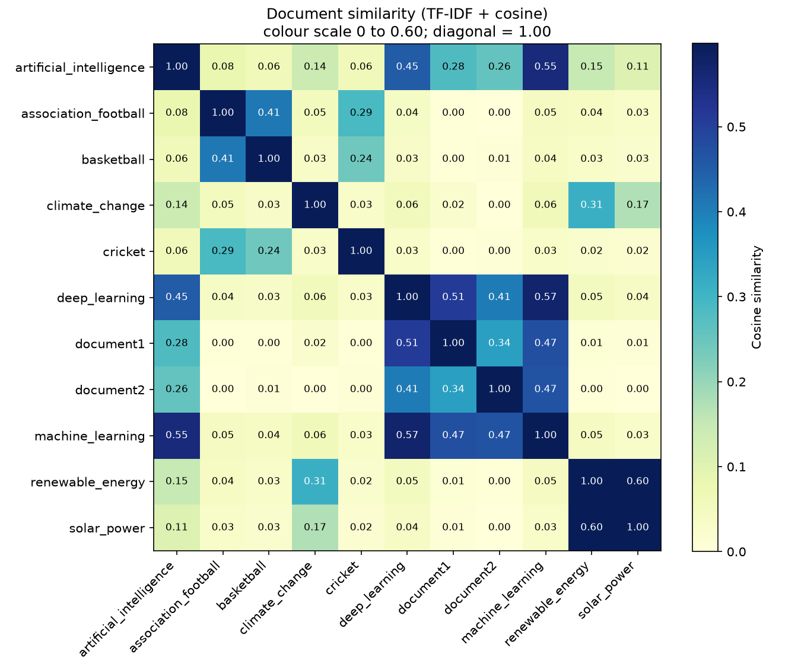

# Document Similarity with a Vector Space Model

Week 3 assignment: measure how similar a set of documents are using a **vector space model**
(TF-IDF weighting + cosine similarity).

Each document becomes a vector of TF-IDF weights, and the similarity of two documents is the
cosine of the angle between their vectors (0 = no shared terms, 1 = same direction).
The TF-IDF and cosine maths are written from scratch with NumPy, then checked against scikit-learn.

## Project structure

```
document-similarity-vsm/
├── download_documents.py   # step 1 - downloads 9 Wikipedia articles into documents/
├── vsm_similarity.py       # step 2 - builds the VSM and computes similarities
├── requirements.txt
├── documents/              # the corpus (.txt / .pdf / .docx) + SOURCES.md
└── outputs/                # created on run: heatmap, CSVs, results.txt
```

## Quick start

```bash
# 1. (optional) create a virtual environment
python -m venv .venv
source .venv/bin/activate          # Windows: .venv\Scripts\activate

# 2. install dependencies
pip install -r requirements.txt

# 3. get the documents (or copy your own files into documents/ instead)
python download_documents.py

# 4. run the analysis
python vsm_similarity.py
```

Optional flags for `vsm_similarity.py`:

| Flag | Meaning |
|------|---------|
| `--docs FOLDER` | folder with the documents (default `documents`) |
| `--out FOLDER` | where results are saved (default `outputs`) |
| `--top-terms N` | keywords to list per document (default 8) |
| `--query "text"` | also rank all documents against a free-text query |
| `--show` | open the heatmap in a window as well as saving it |

Example: `python vsm_similarity.py --query "how do neural networks learn from data"`

## Using your own documents (e.g. news articles)

Save 5-10 articles as `.txt`, `.pdf` or `.docx` files in `documents/` and run
`python vsm_similarity.py`. Old `.doc` files should be re-saved as `.docx` first.
No code changes are needed. Delete the downloaded Wikipedia files if you want only your own set.

## How it works

1. **Load** every `.txt` / `.pdf` / `.docx` file in the folder.
2. **Pre-process**: lowercase, keep alphabetic words, remove English stop-words and 1-2 letter tokens.
3. **Vocabulary + term frequency**: `tf[d, t]` = number of times term `t` appears in document `d`.
4. **TF-IDF**: `tfidf(t, d) = tf(t, d) * idf(t)` with `idf(t) = ln((1 + N) / (1 + df(t))) + 1`,
   where `N` is the number of documents and `df(t)` the number of documents containing `t`.
5. **Cosine similarity**: `cos(a, b) = (a . b) / (|a| |b|)` for every pair of document vectors.
6. **Outputs**: similarity matrix, ranked pairs, top TF-IDF keywords per document, heatmap.
7. **Checks**: the similarity matrix is compared with scikit-learn's `TfidfVectorizer`
   (difference should be ~1e-15), and mean similarity with and without IDF is compared.
8. **Query mode**: a query is turned into a TF-IDF vector with the same vocabulary and IDF values
   and compared with every document.

## Results

After running, the outputs are in `outputs/`:

- `results.txt` - everything printed to the console
- `similarity_matrix.csv` - full N x N cosine similarity matrix
- `ranked_pairs.csv` - all document pairs, most to least similar
- `similarity_heatmap.png` - heatmap of the matrix



## Data licence

Documents downloaded by `download_documents.py` are copies of English Wikipedia articles, available
under [CC BY-SA 4.0](https://creativecommons.org/licenses/by-sa/4.0/). Article URLs and retrieval
date are listed in `documents/SOURCES.md`.

## Publishing on GitHub

1. Create an empty repository on <https://github.com/new> (e.g. `document-similarity-vsm`).
   Leave "Add a README" unticked.
2. In this project folder, run (after you have run the scripts, so `documents/` and `outputs/` are filled):

```bash
git init
git add .
git commit -m "Document similarity with TF-IDF vector space model"
git branch -M main
git remote add origin https://github.com/<your-username>/document-similarity-vsm.git
git push -u origin main
```

3. Open the repository in your browser, check that the code, `documents/` and `outputs/` are there,
   and copy the URL to submit with the report.

## Ideas for extending it

- Add stemming or lemmatization (e.g. NLTK) so "learn", "learning" and "learned" count as one term.
- Use bigrams (`ngram_range=(1, 2)` in scikit-learn) to capture phrases like "climate change".
- Try BM25 weighting, or compare with sentence embeddings.
